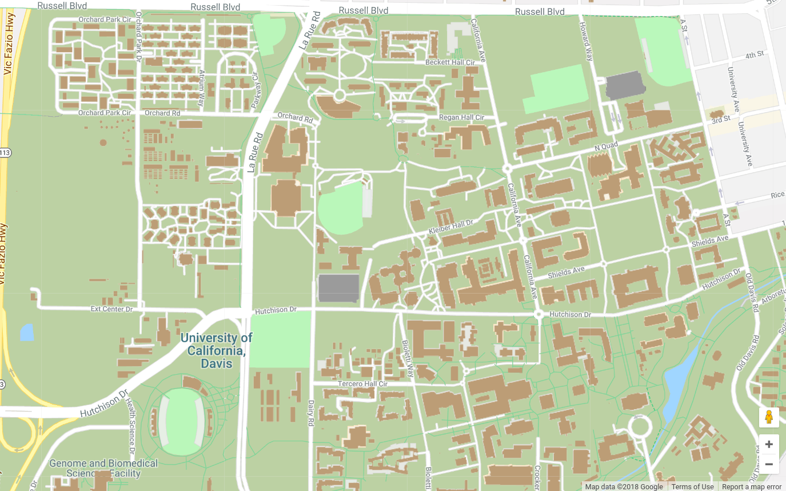

# Overview

## Where we are going

+ What is Bayesian Inference?
+ Why (not) Bayes?
+ MCMC
+ Bayes in applied science

## Assumptions of this presentation

+ A very basic understanding of statistics and probability

+ No programming experience

+ No theoretical statistics/probability knowledge

# What is Bayesian Inference?

## Bayesian Inference

Broadly speaking, Bayesian inference is a means to conduct statistical
inference based on Bayes' Theorem.

Bayes' Theorem states that the probability of an estimate is a
function of:

1. prior knowledge of that estimate

2. information provided by data.

## Bayes Theorem

$$ P(A \mid B) = \frac{P(B \mid A) \, P(A)}{P(B)} $$

$P(A \mid B)$ is the **posterior**, the distribution of probable values
of parameter(s) A given data B.

$P(B \mid A)$ is the **likelihood**, the probability of seeing data B
given possible values of parameter(s) A.

$P(A)$ is the **prior**, the distribution of probable values of
parameter(s) A from prior study/knowledge.

$P(B)$ is the **evidence**, acts as a normalizing constant.

## Bayes Theorem (cont)

$$ P(A \mid B) \propto P(B \mid A) \, P(A) $$

We typically work with this form, because we really only need to know
the posterior up to a proportion.

$P(B)$ can be very difficult to calculate in practice.

## The posterior

"The posterior is a precision-weighted average of the prior and the
likelihood"

+ precision-weighted: The more precise (more certainty), the more
  weight 
  
+ average of the prior and likelihood: The posterior combines
  information from both 
  
## The posterior (cont)

  
## Implications

It is possible for the prior or the likelihood to overwhelm the other.

Neither piece provides **no information** - the closest we can get is
very little.

"Uninformative priors" are really extremely weak priors.

## The power of the prior

The prior was once thought of as a liability to Bayesian inference

+ It's subjectively playing with the data - the prior introduces **bias**

+ Statisticians were bending over backwards to be "un-biased"

+ You can effectively make the conclusion whatever you wish with a
  sufficiently strong prior.

# Why (not) Bayes

## Why (not) Bayes? - background

Bayesian statistics are becoming increasingly popular.

Many see it as the solution to the replication crisis, p-hacking,
researcher degrees of freedom, etc.

It is vogue. All the cool-kids use Bayes.

## Why (not) Bayes?

However, Bayesian analysis cannot save you from yourself.

Every statistical "sin" possible using frequentist stats can be done
using Bayesian statistics.

There are fewer people qualified to review Bayesian methods, less help
available, fewer texts, etc.

It can be easy to get yourself into trouble. Many of the benefits are
"double-edged swords."

## So, why should you use Bayes?

+ Consistent: The solution to every problem is "apply Bayes theorem"

+ Flexible: With a simple framework, you can express many different
  types of models easily.

+ Forces you to write out the model:\* This makes it easier to make
  sure you are really testing what you think you are testing.

+ Priors are explicit in the model: Frequentist analyses often have
  implicit priors that are never known to anyone but the analyst.

+ Bayesian interpretations often align better with our expectations

\* *Increasingly not necessary*

# Benefits of Bayes

## Example: The power of the prior revisited

Over time, statisticians recognized **bias** can be useful

There is a trade off between bias and variance.

+ It is possible to have an un-biased estimate that varies widely with
  different samples.

+ It is possible to have a biased estimate which changes little over
  different samples.
  
## Example: The power of the prior revisited (cont)

Using the prior, Bayesians can **bias** the estimates to:

+ "Automaticly correct" for unbalanced datasets

+ Conduct variable selection

+ Maximize out-of-sample predictive accuracy 

+ Temper estimates from noisy studies (regularization)

## Example: Confidence intervals

I want to make a 50\% confidence interval for the mean of two
values,X~1~ and X~2~ 

What about this method?
 
+ If X~1~ > X~2~, then the confidence interval is $-\infty$ to
  $\infty$

+ If X~1~ < X~2~, then the confidence interval is { } (an empty set).

## Example: Confidence intervals (cont)

Is this a valid 50\% confidence interval?

## Example: Confidence intervals (cont)

Yes, it is.

A confidence interval is an interval produced from a procedure that
results in intervals which contain the true value X\% of the time.

This method creates intervals which contain the true value 50\% of the time.

If this makes you uncomfortable, it is probably because what a
confidence interval actually is does not align with your expectations.

## Example: Credible interval

Credible interval\* is also an interval, but represents the interval
that contains X\% of the posterior probability.

The above example is not a credible interval because any given
interval either contains 100\% of the posterior probability or none.

Credible intervals align with how most people interpret confidence
intervals.

\* *I'm pretty sure Bayesian statisticians named it "credible
interval" so they could try to sneak the abbreviation CI by cranky
reviewers.*

# The problem with Bayesian inference in practice

## The posterior revised

For simple problems, we can derive the analytical posterior. 

For more complex problems, the analytical posterior may be impossible
to derive.

Conundrum: We want to estimate something we do not even know precisely
what it looks like.

## Complex posteriors

For a long time, Bayesians were stuck with problems that could be
analytically solved.

Some tricks helped: conjugate priors were priors that had nice
analytical properties.

To move forward, Bayesians needed a way to sample from the posterior
without having to know its exact form.

# Markov Chain Monte Carlo

## Markov Chain Monte Carlo (MCMC)

MCMC is the technology that makes Bayesian analysis practical

MCMC allows us to estimate from the posterior even when we don't know
its analytical form.

The use of Bayesian analysis "took off" when computational power was
available to run MCMC algorithms.

## Conceptual exercise: Measuring campus

Thought experiment: We want to measure the vertical height for all of
UC Davis Campus.

We want a "map" with the height above ground (building roofs) for
every X,Y coordinate.

We have a jetpack to make life easier.

## Measuring campus

## Best case - known properties

Imagine that every construction on campus followed a set of standards. 

A few numbers (e.g., number of floors) tells you all the other
properties of the construction (height, footprint size, etc.). If this
were the case, we can make our map knowing only a handful of numbers.

But, not many areas on campus are like this... for complicated cases, we need
something else.

## Grid survey

We can walk along campus on a grid, measuring height at set X,Y
points to construct our map.

A large grid size will be faster to complete, but more uncertainty
between the sample points.

A small grid size will take a while to complete, but we are more
certain about how campus changes between the points.

We might spend a lot of time in areas that are not interesting (e.g., the
soccer fields)

We need to be able to measure the height exactly.

## Measuring campus

## Random walk

So, what can we do without measuring exactly?

Maybe instead, we walk randomly through campus, recording where we
have been.

+ Some locations we will visit multiple times.

+ Some locations we will never visit.

+ At a long enough time-interval, we will see everything.

But...

## Random walk (cont)

+ We still spend a lot of time surveying areas with very little change
  (e.g., the soccer fields)
  
+ We still need to measure the height somehow

+ We might end up off campus!

This does not quite work... without another piece, it is just a
really inefficient grid survey.

## Measuring campus

## Metropolis-Hastings

What if we visit a location a number of times in proportion to that
location's relative height?

Then we can use the history of our walk (number of times we visited)
to determine the height of the buildings.

## Metropolis-Hastings (cont)

What would this look like?

1. From a starting place, you decide to go in a random direction for
   a random distance (from 0 to some upper limit).

1. Before you move, you look at where you will land. You evaluate the
   new location's height relative to your current position.  

1. You will move to that new location with a probability related to
   the difference in heights.
   + You will be more likely to move to a location with a height more than your
	 current location
   + You are less likely to move to a location with
     height less than your current location
	 
## Measuring campus

## Metropolis-Hastings (cont)

The number of times you visit a location will be proportional to that
location's relative height! 

You only need to evaluate the relative heights, not exact heights.

You will spend relatively little time exploring areas with low
heights. 

Your search will focus on the areas where there are
buildings.

## Metropolis-Hastings (cont)

Metropolis-Hastings gives us a way to approximate a complex
distribution without having to be able to exactly measure it. We only
need relative probability density/mass. 

## MCMC concepts

MCMC error: the more we visit each location, the more certain we will
be about its value relative to the others.

Autocorrelation: If our distance per jump is too short, every stop
will be accepted. There will be high correlation between jumps and
we will not make it very far.

Acceptance rate: if our distance is too long, many proposed locations
will be off campus, so we will just stay where we start.

Effective size: Ideally, we are moving between locations enough to
balance the above. This results in a high effective sample size. 

## Gibbs sampling

Jumping in a random direction might not be efficient. If you are on
top of a building you want to explore, you might want to restrict your
movement.

What if you only moved in one direction at a time? Instead of randomly
picking a direction AND a distance, you have a set direction
(alternating between for example N-S and E-W) and only randomly pick a distance.

## Hamiltonian Monte Carlo

We can do even better!

Ideally:

+ When we are in a location that has little change (flat), we want to
  move further so we are more likely to land somewhere interesting.
  
+ When we are in a location with lots of change (many buildings), we
  want to move shorter distances to fully explore that area.
  
+ We will be more likely to move towards buildings than away from them.

## Take-aways

The goal of all MCMC samplers is the same: estimate a probability
distribution without needing to know its exact analytic form.

MCMC algorithms all have their strengths and weaknesses.

Some MCMC algorithms are more efficient than others, with the
trade-off of increased complexity.

## Take-aways (cont)

Understanding basic mechanism is essential to diagnosing MCMC
results. (Trust me\*)

Cruising around campus with a jetpack would be super fun.

\* Time allowing, we will see this ourselves.
